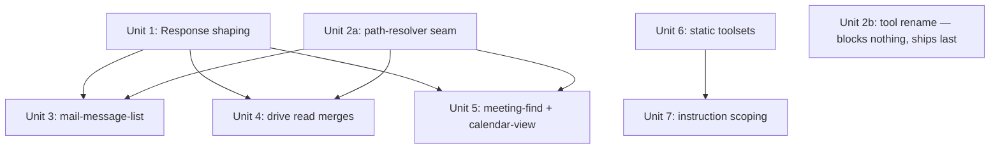

# refactor: Apply 2026 MCP best practices to the MS-365 tool surface

## Overview

The server exposes **48 tools**, almost all 1:1 mirrors of Microsoft Graph endpoints. That surface is hard for LLM agents to use well: near-identical read tools cause wrong-tool selection, every session loads every schema, and list tools return Graph's full verbose payloads. This plan applies the [2026 MCP best-practices research](../research/2026-05-30-01-mcp-best-practices.md) **directly to the design** — it makes the surface ergonomic without weakening the per-user authorization model that is the server's core safety property.

> **This is a greenfield server: no production traffic, no live `policy.yaml`, no existing MCP clients.** That is the load-bearing fact for the whole plan. It means we apply best practices *by design* rather than gating changes on usage telemetry we don't have. Concretely, it removes four things a traffic-bearing server would need: (1) an "instrument-first" durable telemetry store, (2) telemetry-gated phasing, (3) back-compat aliases so deployed policy files keep resolving, and (4) breaking-change migration windows for existing clients. None apply here. This plan **supersedes** an earlier telemetry-gated draft that was written before that fact was confirmed.
>
> **Provenance:** confirmed by the product owner (SGL), 2026-06-01 — no agent or deployment currently calls this server. The README's *Production deployment* section and the committed `policy/policy.yaml` are templates/scaffolding, not a live config. **Safety net (kept in reserve):** if a consumer is later discovered, the Unit 2b rename must become a coordinated cutover — or ship old→new names as a one-time load-time normalize map in `Policy.normalize` — instead of the unconditional rewrite below. That fallback costs one map and is cheaper than a silently-broken operator policy.

What does *not* change: the **authorization invariant**. `Policy.check` (`src/policy/index.ts:128`) keys on a stable `tool.name` with `deny → allow → defaults.allow → fail-closed`, and preconditions (`assertIsDraft`, `assertIsOrganizer`) run per tool as the real security boundary (`src/tool-runtime.ts:124`). Every consolidation below respects it: **never merge across read/write risk classes, never merge two writes of different blast radius, never fold `delete` into another tool.**

This plan defines decisions and sequencing. It does **not** pre-write implementation code.

## Problem Frame

48 endpoint-shaped tools (Mail 8 · Calendar 6 · Teams 18 · SharePoint 8 · Files 3 · Users 2 · Utility 2 · Identity 1). The diseases (origin principles #1/#3) are **endpoint-shaped tools** and **unbounded responses** — not the raw count. Two codebase facts shape the work:

1. **Authorization keys on tool name only** (above). Merges must preserve per-tool gateability.
2. **Neither response shaping nor progressive disclosure exists yet.** `clampTopQueryParam` (`src/tool-runtime.ts:34`) only *clamps* `$top` when present — there is **no default page size and no field projection**. `registerTools` (`src/tool-runtime.ts:527`) registers `ALL_TOOLS` unconditionally — there is **no toolset machinery**.

Because there are no deployed consumers, the design can also fix two things a brownfield plan would have to defer: **inconsistent tool naming** (verb-first kebab, no namespacing) and the **full-payload default** — both are free to change now and costly to change once agents depend on them.

## Requirements Trace

- **R1.** A default list call (no `$select`/`$top`) returns a **bounded, minimal** payload, never Graph's full object. (origin P3)
- **R2.** Single tool responses are capped by a hard token ceiling; truncation is **marked and actionable**, not silent. (origin P3)
- **R3.** Confusable all-read tools are consolidated via optional ids, with **zero loss** of authorization granularity (all parts share a risk class). (origin P1)
- **R4.** Tool names follow a consistent `service-resource-action` convention (two documented exceptions: `calendar-view`, `user-search`); `policy.yaml` is rewritten to match (no production policy to migrate). (origin P7)
- **R5.** Writes are **not** consolidated across risk classes; create/update stay split to preserve the precondition boundary and granular gating; every `delete` stays standalone. (origin P4)
- **R6.** A small **core** toolset loads by default; the long tail (SharePoint, Teams internals, transcripts, all writes) is deferred behind static, deployment-time toolsets; `instructions` are scoped to the enabled set. (origin P2, P9)
- **R7.** No regression to authorization, audit, precondition, pagination, or path-encoding behavior; the full vitest suite stays green. (origin P4, P12)

## Scope Boundaries

- **No telemetry instrumentation as a prerequisite.** No durable tool-call store. The existing in-memory ring buffer (`src/admin/tool-call-log.ts`) and admin dashboard stay exactly as they are. (greenfield — no traffic to mine)
- **No back-compat aliases.** Renames update `policy.yaml` + `policy.yaml.example` directly. No alias-normalization layer, no deprecation window. (no deployed policy)
- **No write upserts.** Create/update stay as separate tools. (R5 — principled call, not a telemetry call)
- **No generic `pathResolver` engine** — per-tool resolvers only, folded into the first consuming unit. (origin critique)
- **No `teams-message-send` omnibus** with a `target` enum. (origin critique)
- **No dynamic discovery tools** (`list-toolsets`/`enable-toolset`). Static, deployment-time selection only. (origin critique)
- **No MCP Resources migration, elicitation, or code-execution** in this effort — see [Deferred Backlog](#deferred-backlog). (origin P8/P10/P13)
- **No Lokka-style raw Graph passthrough tool.** (origin P5)
- **No hard "48→N" target.** The count falls out of the design.

## Context & Research

### Relevant Code and Patterns

- `src/tool-runtime.ts` — `executeTool` (`:92`): policy check `:103`, precondition `:124`, param→path/query/header/body loop `:161`, unknown-param path substitution fallback `:166` (the hazard a path resolver must not regress), `clampTopQueryParam` `:197`, `fetchAllPages` nextLink merge reading `combined.value` `:274`, `toolCallLog.record` calls throughout. `buildMcpParamSchema` (`:381`) injects control params. `registerTools` (`:519`/`:527`) loops `ALL_TOOLS` then `utilityTools`.
- `src/policy/index.ts` — `normalize` (`:81`), `check` (`:128`) keys single-tool-name, fail-closed.
- `src/tools/types.ts` — the `Tool` interface (extend: `toolset`, `pathResolver?`, projection metadata). `ToolPrecondition`.
- `src/tools/index.ts` — `ALL_TOOLS` from per-domain arrays; `utilityTools` separate.
- `src/mcp-instructions.ts` — `buildMcpServerInstructions` returns a flat `parts` array; trivial to assemble per-toolset.
- Per-domain tool files: `src/tools/{mail,calendar,files,sharepoint,teams,users,identity,utility}.ts`.
- `policy/policy.yaml`, `policy/policy.yaml.example` — rewritten to the new names.

*(All file/line references above were independently verified accurate against the current code during plan review.)*

### Institutional Learnings

- The authorization invariant is the one thing that must not regress; it is verified true in `policy/index.ts` and the preconditions. Every design choice below was checked against it.
- The existing audit path (`redactArgs`/`redactResponse`, ring buffer) is sufficient for a no-traffic server; do not build a second store.

### External References

External research is complete in the origin doc (Anthropic *Writing effective tools for agents*; MCP spec 2025-06-18; GitHub *Fewer, better tools*; Microsoft *Tool-Space Interference*; Linear MCP). No further external research needed.

## Key Technical Decisions

| Decision | Rationale |
|---|---|
| **Apply best practices by design; no telemetry gate** | Greenfield — there is no usage to instrument. The empirical "refactor against transcripts" method (origin P11) presumes traffic this server lacks. Gating on absent data would stall the work indefinitely. |
| **Adopt `service-resource-action` naming now** (`mail-message-list`, `drive-item-get`, `calendar-event-create`) | Consistent namespacing reduces wrong-tool selection (origin P7) and is free to do now / expensive once agents depend on names. Rewrite `policy.yaml` to match — no production policy to break, so no aliases. |
| **Response shaping is the design default** | Default `$select` projection + default `$top` + token ceiling. No existing client depends on full payloads, so there is no breaking-change concern (origin P3). |
| **Progressive disclosure ships as a top-tier lever** | A small core toolset + deferred long tail is independently the biggest schema-token win (origin P2); it is not gated behind response shaping. |
| **Writes stay split (no upserts)** | The precondition is the real security boundary and policy gates per name. Merging create+update moves a safety boundary into an in-code branch and removes granular gating for a marginal ergonomics gain. Keep them separate; rename only. |
| **SharePoint drive/site reads stay separate, in a `sharepoint` toolset** | Keeps OneDrive (`Files.Read`) and SharePoint (`Sites.Read.All`) reads as distinct tools and bounds the **tool surface** an agent sees per deployment (origin P4/P5 disambiguation + schema-token reduction). **This does *not* by itself reduce OAuth scope:** `resolveAuthScopes()` (`src/oauth/scopes.ts`) unions scopes over `ALL_TOOLS` and consent is granted once at login. Real scope reduction is a Unit 6 stretch (make `resolveAuthScopes` toolset-aware) **and** requires registering the Entra app with only the core scopes. |
| **Per-tool path resolver, folded into its first consumer** | The optional-id read merges need a tiny resolver returning a fully-substituted path; build it where first used, not as speculative infrastructure (origin critique). |
| **Keep `download-bytes`, all `delete-*`, and all `send-*` standalone** | Distinct risk classes / blast radii that must stay independently gateable. |

## Open Questions

### Resolved During Planning

- *Gate consolidation on telemetry?* No — greenfield, no traffic. Apply best practices by design.
- *Back-compat aliases for renames?* No — no deployed policy; rewrite `policy.yaml` directly.
- *Merge create/update into upserts?* No — keep split to preserve the precondition boundary and granular gating.
- *Merge OneDrive and SharePoint drive reads?* No — keep separate so toolset boundaries also bound OAuth scope.
- *Calendar-view shape?* Conservative: rename `get-calendar-view` → `calendar-view`, drop `list-calendar-events`; no `/me/events` series-master fallback.

### Deferred to Implementation

- Exact `Minimal*` field lists per resource — starting sets are in the origin doc; validate against real Graph responses in Unit 1.
- `nextCursor` encoding for the truncation envelope — opaque token derived from the `@odata.nextLink` path; finalized in Unit 1. Must keep the Graph `value` key (the `fetchAllPages` merge reads `combined.value`).
- The exact membership of the default **core** toolset — see the [consumer question](#deferred-to-product) below; a sensible default is proposed in Unit 6 and is config-adjustable.

### Deferred to Product

- **Which Areté agents/clients consume this server, and what does each need?** This refines (does not block) the default `core` toolset. Unit 6 ships a defensible default (mail + calendar + directory + OneDrive reads + utilities) that any deployment can widen by config; the consumer set lets us tune it. Surface to the team; not a blocker.

## Validation & Success Criteria

Greenfield means success is measured by **design conformance and payload size**, not usage metrics:

1. **Checklist + reviewer.** Each phase's diff passes the `mcp-server-design` skill's `review-checklist.md` and a `sglyon-mcp-reviewer` pass (sgldev plugin).
2. **Payload size, measured first.** Capture the *baseline* raw-Graph responses for `mail-message-list`, `calendar-view`, and `drive-children-list` **before** projecting (a read-only measurement available now), then record the post-projection drop. ~70–90% is the expected ballpark (origin: stripping ~50 fields → ~3–8 cuts ~80–90%), but the criterion is **measure and record the actual reduction**, not pass/fail a fixed number Graph's payload shape could fail for us. Measure both sides in the same serialization format (JSON or TOON).
3. **Schema-token budget.** A core-only deployment registers a materially smaller tool-schema set than today's 48; record the registered count and the rough init-token delta.
4. **Task-level check.** Run 3–5 representative agent prompts (e.g. "find unread mail from X this week", "list my next 5 meetings", "open the latest file in folder Y") against the refactored surface and confirm the agent completes them on the **default** projection — i.e. the `Minimal*` fields are *sufficient*, not just smaller. Converts "best-practices-compliant" into "validated against a real agent task" at near-zero cost.
5. **No regression.** The full vitest suite stays green at every unit (R7).

## High-Level Technical Design

> *This illustrates the intended approach and is directional guidance for review, not implementation specification. The implementing agent should treat it as context, not code to reproduce.*

Request lifecycle after this work (new responsibilities marked ✚):

```
MCP call
  → policy.check(toolName)                       [unchanged]
  → precondition(graphClient, params)            [unchanged — writes stay split]
  → resolve path:
        tool.pathResolver?(params) ?? tool.path  [per-tool resolver, fully substituted ✚]
  → apply query/header/body params               [unchanged]
  → inject default $select + default $top when caller omits ✚
  → Graph request (+ existing fetchAllPages merge, keyed on `value`)
  → shape response: project fields, enforce token ceiling,
        emit {value, truncated, nextCursor, hint} when over budget ✚
  → toolCallLog.record(...)                       [unchanged — existing ring buffer]
```

Tool registration after this work:

```
registerTools()
  → filter ALL_TOOLS by enabled toolsets (env/config) ✚   [default: core]
  → register each; annotations unchanged
buildMcpServerInstructions()
  → assemble only the fragments for enabled toolsets ✚
```

Phase dependency graph:



Units 1, 2a, and 6 are independent and can proceed in parallel. Unit 6 (toolsets) does **not** depend on response shaping — it is its own lever. **Unit 2b (the rename) blocks nothing** and ships last, so the ergonomics wins (response shaping, consolidations, toolsets) never wait on cosmetic churn.

## Implementation Units

### Phase 1 — Foundations (response shaping + naming/resolver seam)

- [ ] **Unit 1: Server-side response shaping (projection + default `$top` + token ceiling)**

**Goal:** A default call returns a bounded, minimal payload; oversized responses truncate with a usable continuation marker.

**Requirements:** R1, R2, R7

**Dependencies:** None

**Files:**
- Create: `src/tools/projections.ts` (`Minimal*` `$select` allow-lists per resource: mail, event, driveItem, user)
- Modify: `src/tools/types.ts` (`Tool` gains optional `projection` metadata: resource key + default-applicable flag)
- Modify: `src/tool-runtime.ts` (`executeTool`: inject default `$select` when caller omits and the tool declares a projection; inject default `$top` (~15) for GET list tools before `clampTopQueryParam`; add `response_format: 'minimal' | 'detailed'` control param in `buildMcpParamSchema`; after the `fetchAllPages` merge, measure response size against a configurable ceiling (~25k tokens) and, when over, truncate at an array-element boundary and wrap as `{ value, truncated: true, nextCursor, hint }` — **keep the `value` key** so the shape matches Graph and the merge)
- Test: `test/response-projection.test.ts`, `test/response-truncation.test.ts`

**Approach:**
- Add `response_format` to `CONTROL_PARAM_NAMES` (`src/tool-runtime.ts:54`) so it is skipped by the param loop and never leaks onto the Graph URL.
- Projection applies only when the tool declares one and the caller passed no `$select`. `detailed` (or an explicit `$select`) bypasses it. **Decision:** `detailed` is *not* a confidentiality boundary — any caller policy-allowed on the tool may request it; tool-level policy is the access control, field projection is a payload-size optimization. State this so it isn't read as an oversight.
- Default `$top` is injected only for **list** GETs, not by-id GETs (e.g. `mail-message-get`, `drive-item-get`). Since the `Tool` shape has no list-vs-by-id flag today, add one (e.g. `isList: true` on list tools, or key off the presence of a projection + collection path) and gate the default on it.
- Truncation runs after the `fetchAllPages` merge but the merge **deletes `@odata.nextLink`** (`:310`) — so derive `nextCursor` before that deletion, or from an independent re-page. `nextCursor` is an opaque token from the `@odata.nextLink` path; with no nextLink (single over-budget page) emit `truncated: true` + `hint`, no cursor.
- The token ceiling is measured on the **serialized** payload, *after* any TOON serialization (the existing `--toon`/`MS365_MCP_OUTPUT_FORMAT` path) — confirm the `{value, truncated, nextCursor, hint}` envelope survives TOON serialization, and measure the ≥70% target against the same format on both sides.
- Binary / `rawResponse` / download responses are exempt.

**Patterns to follow:** control-param injection in `buildMcpParamSchema`; the `fetchAllPages` block (`:274`).

**Test scenarios:**
- Happy path: list call with no `$select` returns only `Minimal*` fields; `response_format: 'detailed'` returns the full set.
- Edge case: caller-supplied `$select` respected verbatim; caller `$top` above `MS365_MCP_MAX_TOP` still clamped.
- Edge case: over-budget list truncates at an element boundary, stays valid JSON, keeps the `value` key, reports the cut count, and yields a usable `nextCursor`; under-budget responses are unchanged.
- Edge case: a binary/`rawResponse` download is exempt from both projection and truncation.
- Integration: projection + `fetchAllPages` merge yields projected fields across pages; a returned `nextCursor` retrieves the next slice.

**Verification:** Representative `mail`/`calendar`/`drive` list calls return small fixed field sets with a measured token-size drop; `test/binary-response.test.ts` and the full suite pass.

- [ ] **Unit 2a: Per-tool path-resolver seam**

**Goal:** The minimal mechanism the read merges (Units 3–5) need — a per-tool resolver returning a fully-substituted Graph path. **No renames here.**

**Requirements:** R7

**Dependencies:** None

**Files:**
- Modify: `src/tools/types.ts` (`Tool` gains optional `pathResolver?(params): string` and `resolverParams?: string[]` — the explicit param names the resolver consumes)
- Modify: `src/tool-runtime.ts` (`executeTool`: if `tool.pathResolver`, use its path and add `resolverParams` to the skip-set checked **before** the `if (!def)` unknown-param fallback at `:166`, so consumed params never leak to path/query; assert no `{placeholder}` survives)
- Test: `test/path-resolver.test.ts`

**Approach:**
- The carrier for "which params the resolver consumed" is an explicit `Tool.resolverParams: string[]` — not left for the implementer to invent. `executeTool` skips those names alongside `CONTROL_PARAM_NAMES` (`:54`) at the top of the param loop.
- Resolver returns a complete path; a dev-time assertion catches leftover `{…}`.

**Patterns to follow:** `encodePathValue`/path handling and the `CONTROL_PARAM_NAMES` skip in `executeTool`.

**Test scenarios:**
- Happy path: a `pathResolver` tool produces the correct path per param combination; `resolverParams` never appear as query params nor hit the `:166` fallback.
- Edge case: resolver output with an unsubstituted `{placeholder}` is caught by the assertion, not sent to Graph.
- Edge case: a tool without a resolver uses the existing path logic unchanged (`test/path-encoding.test.ts` passes).

**Verification:** Resolver seam exists and is tested; no behavior change to any current tool; full suite green.

- [ ] **Unit 2b: `service-resource-action` rename (ships last; blocks nothing)**

**Goal:** One consistent naming convention across all tools and both policy files, in a single pass so names never drift. **Sequenced last** — the origin flagged the rename as highest-blast-radius / lowest-value, so it rides *after* the ergonomics wins (Units 1, 3–5, 6/7) land, isolated and reversible.

**Requirements:** R4, R7

**Dependencies:** None functional; by preference sequence after Units 1, 3–5, 6/7. (Greenfield safety net: if a consumer is discovered, convert to a load-time normalize map per the Overview rather than a hard overwrite.)

**Files:**
- Modify: every `src/tools/*.ts` (rename each tool to `service-resource-action`: `get-me`→`identity-get-me`, `list-users`→`user-search`, `list-mail-folders`→`mail-folder-list`, `get-mail-message`→`mail-message-get`, `list-sites`→`sharepoint-site-list`, …)
- Modify: `policy/policy.yaml`, `policy/policy.yaml.example` — rewrite `defaults.allow`, **all per-user `allow`/`deny` blocks, and the commented write-allow example block** (14 old write names: `create-draft-email`, `update-mail-message`, `add-mail-attachment`, `delete-mail-message`, `create-/update-/delete-calendar-event`, `send-chat-message`, `send-channel-message`, `send-channel-message-reply`, `create-/update-/delete-online-meeting`) to the new names
- Modify: `README.md` (tool-name references)
- Test: update name-bearing assertions across `test/*` (~10 files key on names: `admin-dashboard`, `admin-policy-edit`, `calendar-view`, `policy-manager`, `policy`, `teams-tools`, `tool-call-log`, `tool-runtime-logging`, `users-sharepoint-tools`, `write-tools`); add a test asserting every name in `policy.yaml.example` — commented or not — matches a registered tool

**Naming convention:** `service-resource-action` is the rule; two established names are **deliberate exceptions** kept for agent familiarity / Graph parity — `calendar-view` (Graph's `calendarView`) and `user-search` (directory search). Document them rather than forcing `calendar-event-view` / `user-search-users`.

**Approach:** Mechanical, broad, single pass with the policy files. Run `sglyon-mcp-reviewer` on the diff.

**Test scenarios:**
- Happy path (policy): `policy.yaml` rewritten to new names authorizes the renamed tools; `check` stays single-key/fail-closed (`test/policy.test.ts`).
- Edge case: a name in `policy.yaml.example` with no registered tool fails the new consistency test (catches missed renames).

**Verification:** All tools carry consistent names; both policy files (including the commented block) match; full suite green.

### Phase 2 — Read consolidations (all GET, same risk class)

- [ ] **Unit 3: `mail-message-list`**

**Goal:** Collapse `list-mail-messages` + `list-mail-folder-messages` into one tool with an optional `folder-id`.

**Requirements:** R3

**Dependencies:** Unit 1 (projection), Unit 2a (resolver)

**Files:**
- Modify: `src/tools/mail.ts` (new `mail-message-list` with `pathResolver` branching `/me/messages` vs `/me/mailFolders/{folder-id}/messages`; keep `MAIL_SEARCH_TIP`; declare the mail projection)
- Modify: `policy/policy.yaml`, `policy/policy.yaml.example`
- Test: extend `test/mail-folders.test.ts`

**Approach:** `folder-id` absent → mailbox-wide; present → that folder. Keep `mail-folder-list` (folder discovery) and `mail-message-get` (by-id) separate.

**Test scenarios:**
- Happy path: no `folder-id` lists across the mailbox; with `folder-id` lists that folder.
- Edge case: default projection + default `$top` apply (Unit 1 integration).
- Edge case: `folder-id` is consumed by the resolver and never appears as a query param.

**Verification:** Both prior behaviors reachable through one tool; mail tests pass.

- [ ] **Unit 4: `drive-children-list` and `drive-item-get` (OneDrive)**

**Goal:** Collapse the OneDrive read tools in `src/tools/files.ts` (`list-folder-files`, `get-drive-root-item`, `get-drive-item`) into `drive-children-list` + `drive-item-get` with an optional `item-id`. The SharePoint `/drives/{drive-id}/...` reads (currently `list-drive-root-children`, `list-drive-folder-children`, `get-drive-item-by-id` in `src/tools/sharepoint.ts`, all `Sites.Read.All`) are **renamed and kept in the `sharepoint` toolset — not merged** into these OneDrive tools.

**Requirements:** R3

**Dependencies:** Unit 1, Unit 2a

**Files:**
- Modify: `src/tools/files.ts` (`drive-children-list`: `item-id` absent → `/me/drive/root/children`, present → `/me/drive/items/{item-id}/children` — note `get-drive-root-item` returns the root *item*, not its children, so the no-id branch targets `/root/children` directly; `drive-item-get` ← `get-drive-item` (`/me/drive/items/{item-id}`) + `get-drive-root-item` (`/me/drive/root`); optional `item-id` via resolver; declare the driveItem projection)
- Modify: `src/tools/sharepoint.ts` (rename the `/drives/{drive-id}` reads, e.g. `sharepoint-drive-children-list`, `sharepoint-drive-item-get`; they keep `Sites.Read.All` and stay in the `sharepoint` toolset — do NOT fold them into the OneDrive tools)
- Modify: `policy/policy.yaml`, `policy/policy.yaml.example`
- Test: extend `test/onedrive-folders.test.ts`

**Approach:** OneDrive only (`Files.Read`); paths are always `/me/drive/...`, so these tools have **no `drive-id` param**. The SharePoint drive reads are a separate `Sites.Read.All` family in the `sharepoint` toolset. To keep the split legible to the agent (the wrong-tool-selection risk this plan is curing), the OneDrive tool descriptions carry an explicit *"for SharePoint document libraries, use the `sharepoint-*` tools"* note (origin P6 disambiguation). Per the scope correction in Key Technical Decisions, separating the families bounds the **tool surface**, not the OAuth scope, on its own.

**Test scenarios:**
- Happy path: `item-id` absent → `/me/drive/root/children` (children) / `/me/drive/root` (item); present → `/me/drive/items/{item-id}/...`.
- Edge case: projection applies to driveItem fields; resolver-consumed `item-id` never appears as a query param.
- Edge case: the SharePoint drive tools stay registered under their `sharepoint-*` names in the `sharepoint` toolset.

**Verification:** OneDrive reads collapse to two `Files.Read` tools; SharePoint drive reads stay separate; OneDrive/SharePoint tests pass.

- [ ] **Unit 5: `online-meeting-find` and conservative `calendar-view`**

**Goal:** Collapse the meeting find/get chain; simplify calendar reads.

**Requirements:** R3, R7

**Dependencies:** Unit 1, Unit 2a

**Files:**
- Modify: `src/tools/teams.ts` (merge the current `find-online-meeting` — which today takes a raw `$filter` param the model must hand-write — and `get-online-meeting` (by `meeting-id` path) into one `online-meeting-find` taking `meeting-id` **or** `join-web-url`; the `join-web-url` branch **replaces the raw `filter` param** with a clean URL param the runtime turns into `$filter=joinWebUrl eq '<url>'`, so the model never writes OData; a precondition enforces exactly one key — a read-tool precondition guarding a usage invariant, not a security one)
- Modify: `src/tools/calendar.ts` (rename `get-calendar-view` → `calendar-view`; **drop** `list-calendar-events`; **no** `/me/events` fallback; keep `calendar-event-get` by-id)
- Modify: `policy/policy.yaml`, `policy/policy.yaml.example`
- Test: extend `test/teams-tools.test.ts`, `test/calendar-view.test.ts`

**Approach:** Meeting by id → `/me/onlineMeetings/{id}`; by url → `…?$filter=joinWebUrl eq '<url>'` built in code. Pair with `parse-teams-url`.

**Test scenarios:**
- Happy path: `online-meeting-find` by `meeting-id` and by `join-web-url` each resolve correctly.
- Error path: neither or both lookup keys → precondition refusal before any Graph call.
- Happy path: `calendar-view` matches the old `get-calendar-view`; `list-calendar-events` is gone.

**Verification:** Meeting resolution is one call with a clean URL param; calendar/teams tests pass.

### Phase 3 — Progressive disclosure

- [ ] **Unit 6: Static toolset tags + deployment-time registration filter**

**Goal:** Load a small core by default; defer the long tail by config.

**Requirements:** R6

**Dependencies:** Units 3–5 (the consolidated tools to tag). Independent of the Unit 2b rename — tag by toolset regardless of name; if 2b lands later, the tags travel with the renamed tools.

**Files:**
- Modify: `src/tools/types.ts` (`Tool` gains `toolset: 'core'|'mail'|'calendar'|'files'|'teams'|'sharepoint'|'directory'`)
- Modify: each `src/tools/*.ts` (tag every tool)
- Modify: `src/tool-runtime.ts` (`registerTools` `:527`: filter `ALL_TOOLS`/`utilityTools` by an env/config allowlist read **at the use site** (follow the `maxTopFromEnv()` pattern, `:21`) or a small new `src/toolset-config.ts` — **not** `cloud-config.ts`, which is a cloud-endpoint resolver, not a config hub; default = core; **log a startup warning** for any `policy.yaml` allow-entry whose tool is not registered, and an **INFO line** listing registered tools with no policy entry (they fail closed — operational nudge) so the two planes stay observable in both directions)
- Stretch: `src/oauth/scopes.ts` (`resolveAuthScopes()` — make it filter by the enabled toolset so a core deployment actually requests fewer scopes; pairs with matching the Entra app registration. Without this, the toolset filter reduces tool surface only, not OAuth scope — see Key Technical Decisions)
- Test: `test/toolset-registration.test.ts`

**Approach:** Proposed default **core**: `identity-get-me`, `user-search`, `user-get`, `mail-folder-list`, `mail-message-list`, `mail-message-get`, `calendar-view`, `calendar-event-get`, `drive-children-list`, `drive-item-get`, plus utilities (`download-bytes`, `parse-teams-url`). Defer `sharepoint`, `teams`, transcripts, and all writes (`mail-draft-*`, `calendar-event-create/update/delete`, `*-send`, `online-meeting-*` writes) behind their toolsets. Config-adjustable; see the [consumer question](#deferred-to-product).

**Test scenarios:**
- Happy path: default config registers only core + utilities; enabling `teams` adds teams-tagged tools.
- Edge case: an unknown toolset name is ignored with a warning; core still loads.
- Edge case: a `policy.yaml` allow-entry for a non-registered tool logs a startup warning.
- Edge case: `registeredCount` reflects the filtered set.

**Verification:** A core-only deployment exposes a small, recorded schema set; enabling a toolset widens it; warnings fire as specified.

- [ ] **Unit 7: Per-toolset instruction scoping**

**Goal:** `instructions` carry only guidance for enabled toolsets.

**Requirements:** R6

**Dependencies:** Unit 6

**Files:**
- Modify: `src/mcp-instructions.ts` (`buildMcpServerInstructions`: assemble `parts` from per-toolset fragments based on the enabled set)
- Modify: `src/server.ts` (pass enabled toolsets)
- Test: extend `test/mcp-instructions.test.ts`

**Approach:** Split the flat `parts` into fragments keyed by toolset (OData/general always on; KQL/search with mail; HTML guidance with teams; etc.). Emit only enabled fragments.

**Test scenarios:**
- Happy path: core-only config omits Teams HTML guidance; enabling teams includes it.
- Edge case: general OData guidance always present; `multiAccount` line still appends.

**Verification:** Instruction content tracks the enabled toolsets; mcp-instructions tests pass.

## Deferred Backlog

Out of scope for this effort; revisit deliberately, not by default:

- **MCP Resources for static reference** (OData/KQL rules, scope map). Unit 7's per-toolset instruction scoping already delivers the token win for clients that don't fetch Resources; revisit only after confirming the primary MCP clients reliably inject Resources. (origin P8)
- **Write create/update upserts.** Intentionally not done (R5). Revisit only if a concrete agent workflow shows the split create/update tools cause real friction *and* the unguarded-create-branch tradeoff is accepted.
- **Durable tool-call telemetry.** Revisit once the server has real traffic and there is something to mine; at that point it is a genuine analytics feature with its own PII-at-rest design (encrypt or strip response excerpts), not a prerequisite. (origin P11)
- **Elicitation confirmation on writes / code-execution path.** (origin P10/P13)

## System-Wide Impact

- **Interaction graph:** Changes funnel through `executeTool` and `registerTools` (`src/tool-runtime.ts`) and the renamed tool defs. The admin dashboard's read of `toolCallLog` is untouched (no telemetry changes).
- **Error propagation:** Truncation (Unit 1) must never throw into a tool call — failures log and return the un-truncated response rather than erroring.
- **API surface parity:** Projection / default-`$top` / truncation apply uniformly to **all** GET list tools, not just consolidated ones.
- **OAuth scope vs tool surface:** The toolset filter bounds which tools an agent can *call*, **not** what the access token *contains* — `resolveAuthScopes()` unions scopes over `ALL_TOOLS` and consent happens once at login (`src/oauth/scopes.ts`, `src/server.ts`). To actually drop `Sites.Read.All` for a core deployment, make `resolveAuthScopes` filter by the enabled toolset (Unit 6 stretch) **and** register the Entra app with only the core scopes. Absent that, the plan claims only tool-surface reduction, not scope reduction.
- **Unchanged invariants:** `Policy.check` precedence and single-key matching; precondition-as-security-boundary; `encodePathValue`; existing audit/redaction; binary/`rawResponse` download path; the in-memory tool-call ring buffer.

## Risks & Dependencies

| Risk | Mitigation |
|---|---|
| Mass rename desyncs code and `policy.yaml` | Rename code + both policy files in one unit (Unit 2); name-bearing tests updated in the same pass; startup warning (Unit 6) flags any allow-entry without a registered tool. |
| Path resolver leaks an unsubstituted placeholder or a consumed param to Graph | Resolver returns a fully-substituted path and declares consumed params the loop skips; assertion + test reject leftover `{…}` and stray query params. |
| Default projection hides a field a caller needs | `response_format: 'detailed'` and explicit `$select` both bypass projection; `Minimal*` lists validated against real responses (Unit 1). |
| Truncation produces invalid JSON / unusable cursor / wrong key | Truncate at element boundaries, keep the `value` key, test JSON validity + cursor round-trip + the no-nextLink case. |
| Core toolset omits a tool a real consumer needs | Default core is a superset of the common reads; toolsets widen by config; the consumer question is surfaced to product to tune membership. |
| SharePoint reads needed but `sharepoint` toolset disabled | Documented as a deployment setting; enabling the toolset is one config change. |

## Documentation / Operational Notes

- Update `README.md` (new tool names, the `response_format` / token-ceiling / default-`$top` / enabled-toolset env settings) and `policy/policy.yaml.example` (new names) as each phase lands.
- Document the enabled-toolset config and the default core set.
- Run `sglyon-mcp-reviewer` (sgldev plugin) against each phase's diff; treat the `mcp-server-design` checklist as the bar.

## Sources & References

- **Origin document:** [docs/research/2026-05-30-01-mcp-best-practices.md](../research/2026-05-30-01-mcp-best-practices.md)
- Runtime: `src/tool-runtime.ts` (`executeTool`, `registerTools`, `clampTopQueryParam`, `fetchAllPages`)
- Policy: `src/policy/index.ts` (`normalize`, `check`)
- Instructions: `src/mcp-instructions.ts`; tool composition: `src/tools/index.ts`, `src/tools/types.ts`
- Review bar: `sglyon-mcp-reviewer` agent + `mcp-server-design` skill (sgldev plugin)
